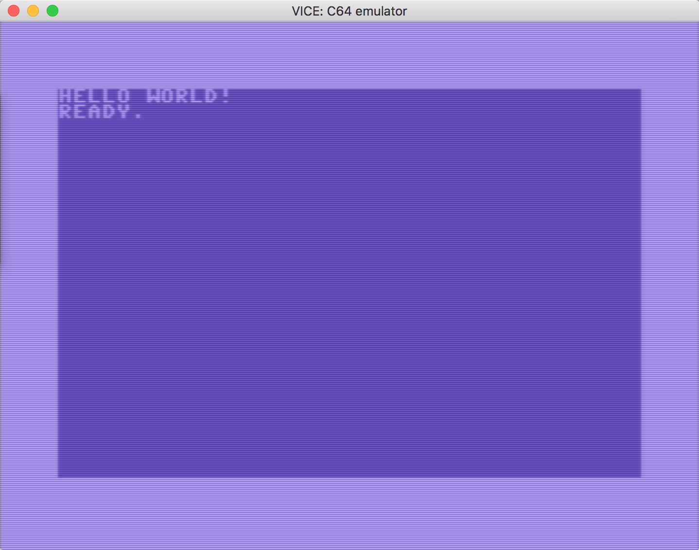
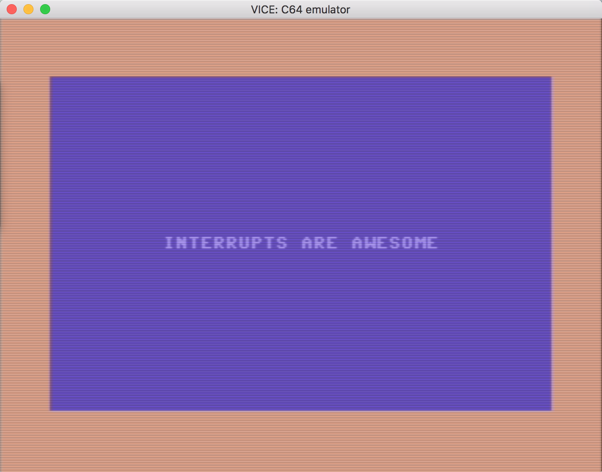

# 6502Assembly
Small projects in **6502/6510** assembly targeting the **ACME** assembler for **Commodore 64**. 
This is intended as a reference for more complicated projects.

## Setup
You will need to install the **ACME** assembler and **Vice** C64 emulator.

On **OSX**, you can either use **Homebrew** to install these dependencies,
or the **DUST** command line utility.

### Homebrew
Follow instructions at http://brew.sh/ if you do not have Homebrew installed, then:
```
brew update
brew install acme vice
```

### DUST
Follow instructions at http://dustlayer.com/c64-coding-tutorials/2013/2/10/dust-c64-command-line-tool.

## Build
To build and run the project, ensure you have `acme`, `c1541`, and `x64` on your path.

Run `make [project]`, where `[project]` is one of:
- `helloworld`
- `ex_interrupts`

## Projects
There are several tiny projects in this repository, each an exercise in some 
aspect of programming in assembly for the **C64**.

### helloworld
This project shows how to start a program, store bytes in RAM, clear the screen, 
show characters on the screen, use registers, loop, and complete a subroutine.



### ex_interrupts
This project shows how to disable the various interrupts, enable raster interrupts for a specific 
line, use the interrupt vector to override the system interrupt subroutine, and define a custom
interrupt subroutine.



